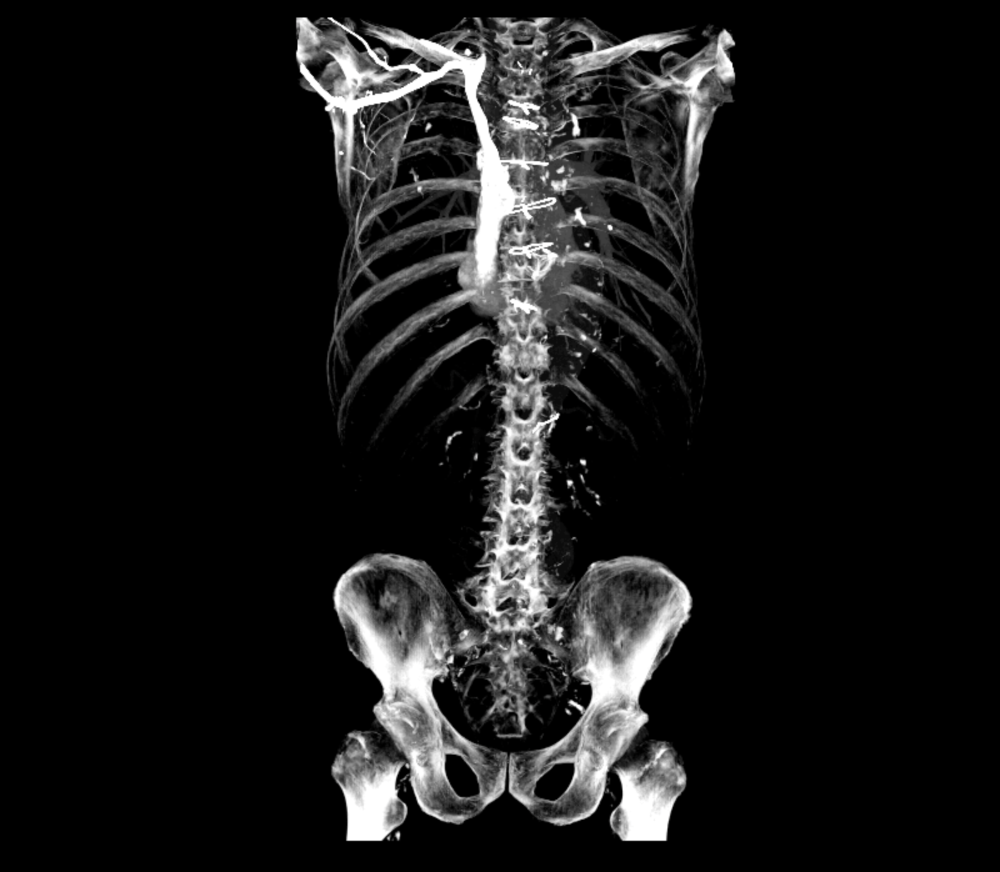
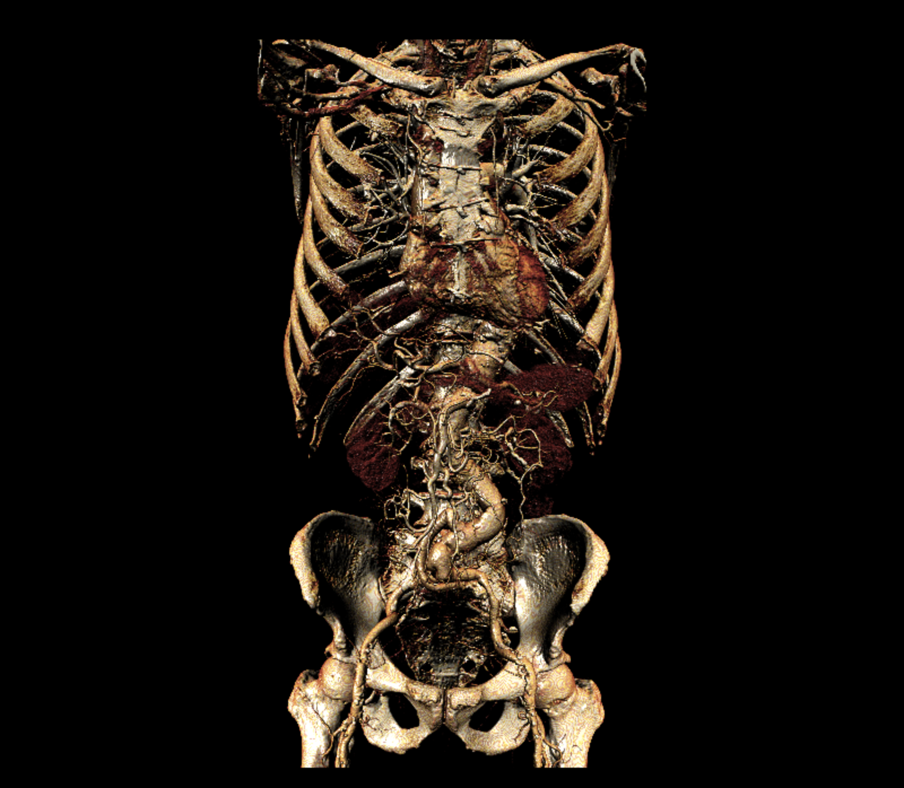

# Ossium

A volume rendering application to display 3D volumes created from DICOM files in the browser, using WebGPU. Two rendering techniques are implemented: Multi-Planar Reformatting (MPR) using maximum intensity projection and Shaded Volume Rendering (SVR) using Blinn-Phong lighting. The application must be viewed in a browser that [supports WebGPU](https://github.com/gpuweb/gpuweb/wiki/Implementation-Status) and has it enabled.

## Installation and Usage

Clone the repository and install the dependencies:
```sh
git clone https://github.com/fraserlove/ossium.git
yarn install
```
Build the application and start the development server:
```sh
yarn dev
```
The application runs on port `8081` and can be accessed in the browser by going to `http://localhost:8081`.

### Keybindings

| Action | Controls |
|--------|----------|
| Rotate | `Left Click` + Drag |
| Pan | `Right Click` + Drag |
| Zoom | `Vertical Scroll` |
| Cine | `Horizontal Scroll` |
| Change Light Direction | `Shift` + `Left Click` + Drag (SVR only) |

## Examples




